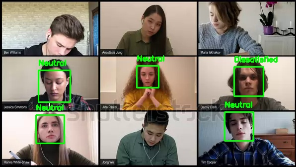
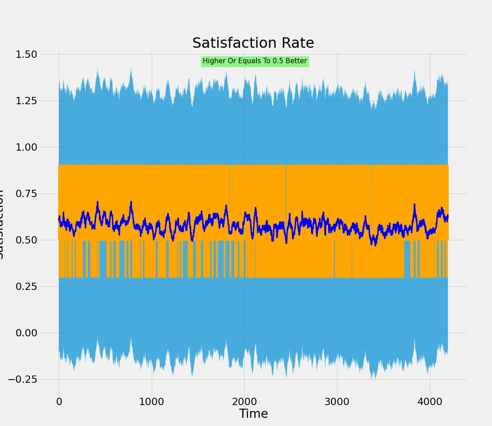
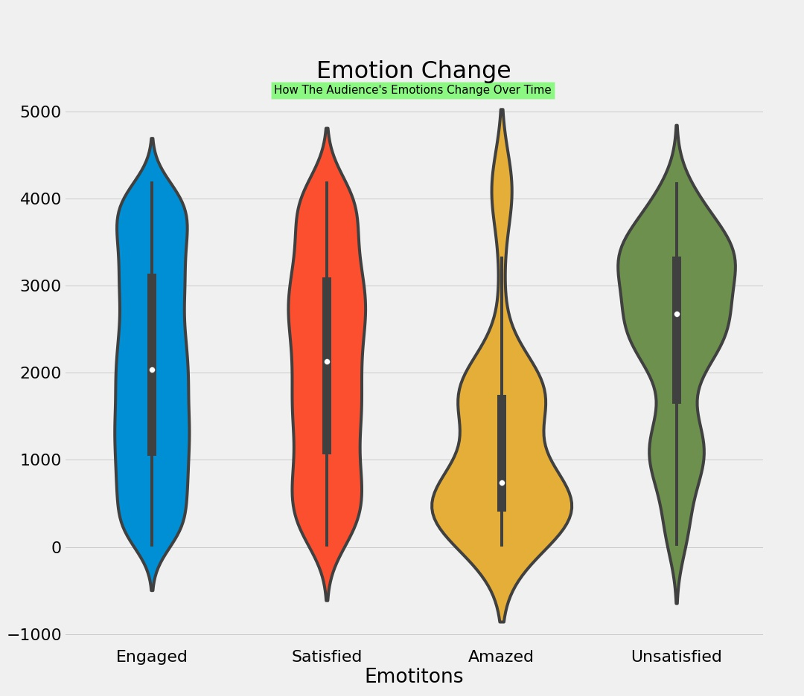
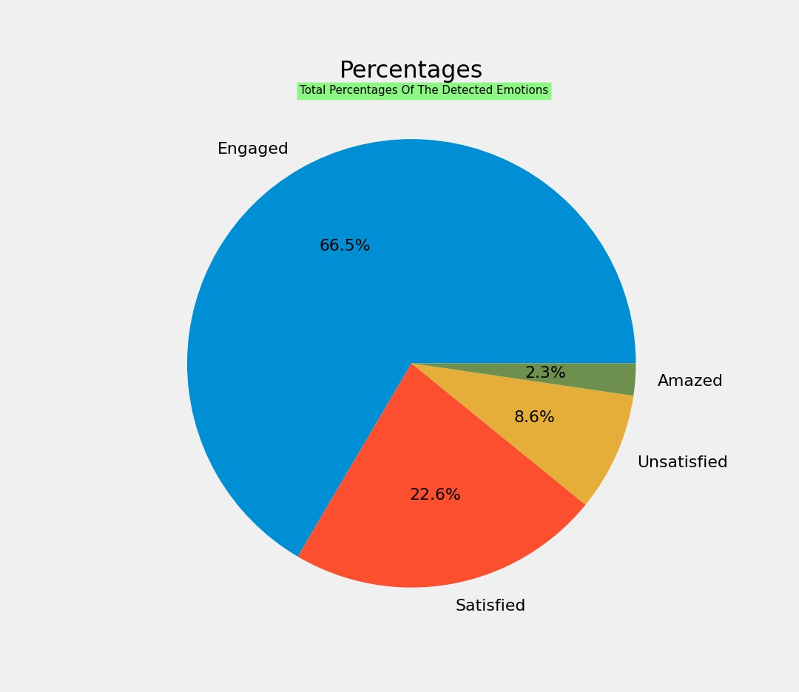
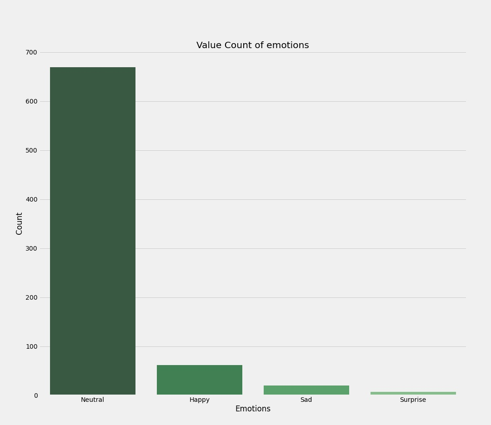
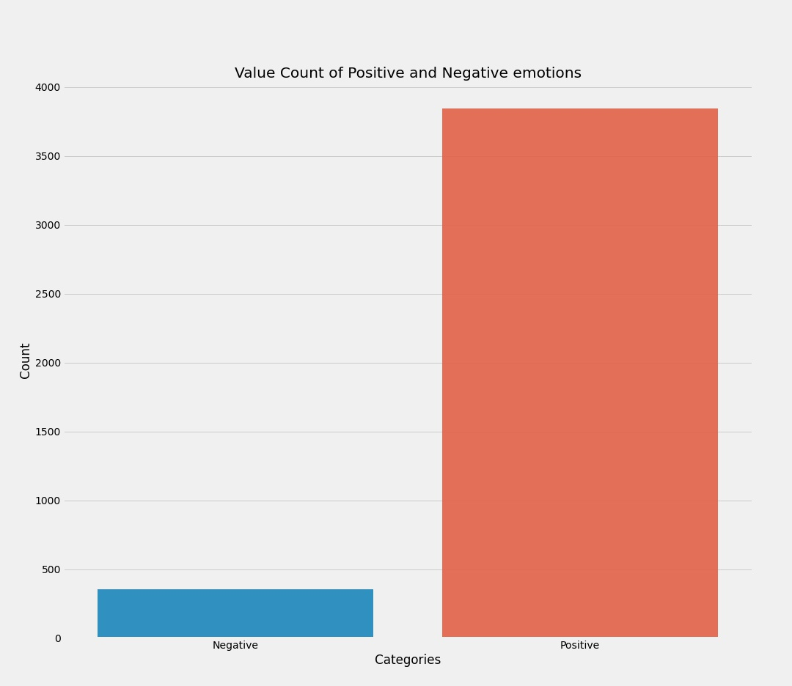

# VisionNet

### Overview
VisionNet is an Emotion Recognition system, we have used the FER-2013 dataset to train our model on. The FER-2013 dataset was **created by gathering the results of a Google image search of each emotion and synonyms ​​of ​​the ​​emotions**. The CK+ dataset has a total of 5,876 labeled images of 123 individuals.

The code accepts an **mp4** video and and performs face detection on each video frame and uses the model to classify emotions. The collected data is then graphed and analyzed.

For facial detection, we are currently using [Haarcascade](https://github.com/opencv/opencv/tree/master/data/haarcascades) Object detection algorithm. However soon we will be implementing the [SSD](https://jonathan-hui.medium.com/ssd-object-detection-single-shot-multibox-detector-for-real-time-processing-9bd8deac0e06) (Single Shot Detection) algorithm which could improve our facial detection accuracy significently. 

 
 

### Example
Below image is the result of the model output:
 

 
 

### Data Analysis
With the current data we generate several graphs, such as Piechart, Distribution plot, Violin plot, and Bar plot.

Check out the examples below:
 

Distribution Plot

 

Violin Plot

 

Pie Chart

 

Bar Plot

 

Bar Plot

